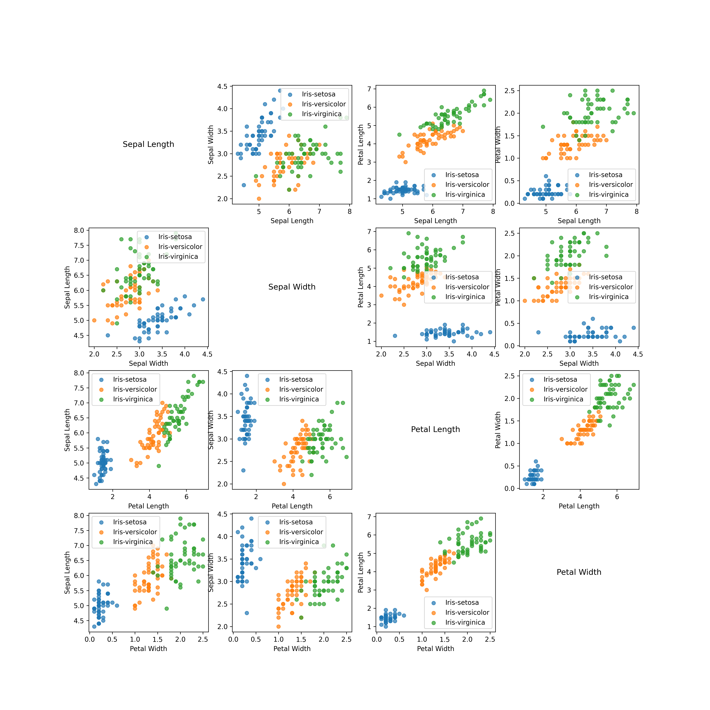

# CS5785 Homework 0

[Yufan Zhang](https://yufanbruce.com) (NetID: yz2894)

## 3.1

> Find and download the Iris Flowers dataset from the UC Irvine Machine Learning datasets archive at http://archive.ics.uci.edu/ml/datasets.php Hint: The iris.names file describes the structure of the dataset. How many features/attributes are there per sample? How many different species are there, and how many samples of each species did Anderson record?

### Answer

There are 4 features per sample. There are 3 different species, and 50 samples of each species.

## 3.3

> To visualize this dataset, we would have to build a p-dimensional scatterplot. Unfortunately, we only have 2D displays so we must reduce the dataset’s dimensionality. The easiest way to view the set is to plot two attributes of the data against one another and repeat for each pair of attributes.
>
> Create every possible scatterplot from all pairs of two attributes. (For example, one scatterplot would graph petal length vs sepal width, another would graph petal length vs. sepal length, and so on). Within each scatterplot, the color of each dot should correspond with the sample species.

### Answer

